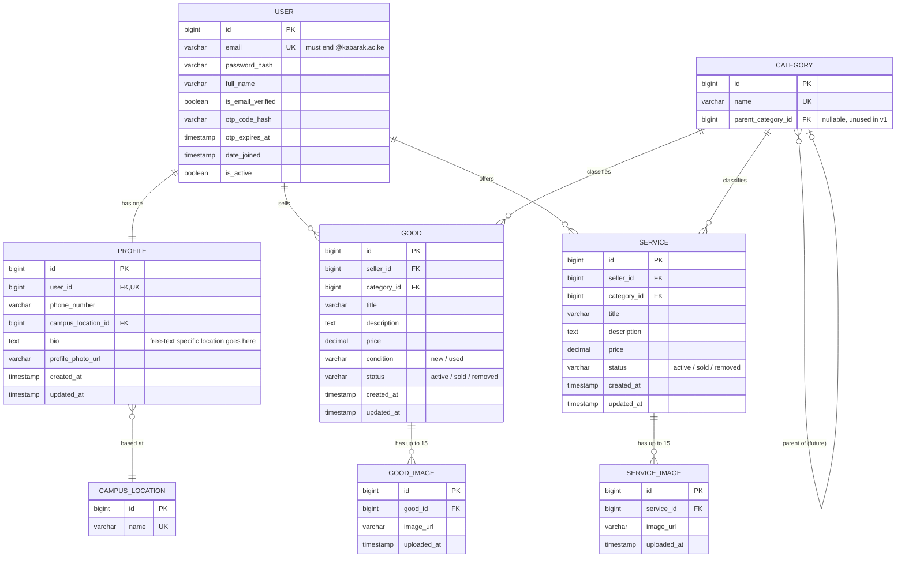

# Database Design — Student Marketplace E-Commerce System

**Project:** Kabarak University Student Marketplace E-Commerce System
**Database:** PostgreSQL (Relational Database Management System)
**Framework:** Django (Object-Relational Mapper / ORM)
**Status:** Draft v1 — pending confirmation of items listed in `flags.md`

This document is the single source of truth for the database schema. It expands and formalizes Section 3.6.5 of the research paper, which sketched four entities (User, Product, Category, Profile) at a conceptual level only.

---

## 1. Entity-Relationship Diagram (ERD)

> `SERVICE_IMAGE` is included per FLAG 3 in `flags.md` as a default, not a confirmed requirement — remove it if services shouldn't carry images.

---

## 2. Table Definitions

### 2.1 `User`

Custom Django user model (extends `AbstractUser` rather than Django's default, since the default model doesn't have OTP or email-domain fields).

| Column | Type | Constraints | Notes |
|---|---|---|---|
| `id` | `BIGINT` | Primary Key (PK), auto-increment | |
| `email` | `VARCHAR(255)` | Unique, `NOT NULL`, `CHECK (email ~ '@kabarak\.ac\.ke$')` | Enforces university domain at the database layer (FLAG 9) |
| `password_hash` | `VARCHAR(255)` | `NOT NULL` | Handled by Django's built-in password hashing |
| `full_name` | `VARCHAR(150)` | `NOT NULL` | |
| `is_email_verified` | `BOOLEAN` | `NOT NULL`, default `FALSE` | Flips to `TRUE` after OTP (One-Time Password) success |
| `otp_code_hash` | `VARCHAR(255)` | Nullable | Hashed, not plaintext (FLAG 5) |
| `otp_expires_at` | `TIMESTAMP` | Nullable | TTL (Time To Live) check: `now() > otp_expires_at` means expired |
| `date_joined` | `TIMESTAMP` | `NOT NULL`, default `now()` | |
| `is_active` | `BOOLEAN` | `NOT NULL`, default `TRUE` | Standard Django flag, doubles as account disable switch |

OTP fires once at registration only (per your answer to Q2). Once `is_email_verified = TRUE`, `otp_code_hash` and `otp_expires_at` are cleared (set to null) and unused thereafter.

---

### 2.2 `Profile`

One-to-one extension of `User`.

| Column | Type | Constraints | Notes |
|---|---|---|---|
| `id` | `BIGINT` | PK, auto-increment | |
| `user_id` | `BIGINT` | Foreign Key (FK) → `User.id`, Unique, `NOT NULL` | Enforces 1:1 |
| `phone_number` | `VARCHAR(20)` | Nullable | Unverified (FLAG per your Q4 answer) |
| `campus_location_id` | `BIGINT` | FK → `CampusLocation.id`, Nullable | Fixed dropdown |
| `bio` | `TEXT` | Nullable | Free text — user adds specific location detail here |
| `profile_photo_url` | `VARCHAR(500)` | Nullable | |
| `created_at` | `TIMESTAMP` | `NOT NULL`, default `now()` | |
| `updated_at` | `TIMESTAMP` | `NOT NULL`, auto-update | |

---

### 2.3 `CampusLocation`

Lookup table — fixed list, admin-managed.

| Column | Type | Constraints | Notes |
|---|---|---|---|
| `id` | `BIGINT` | PK, auto-increment | |
| `name` | `VARCHAR(100)` | Unique, `NOT NULL` | e.g. seed data placeholder — real list needed (FLAG 8) |

---

### 2.4 `Category`

Flat list today; `parent_category_id` reserved for future subcategories (unused, always `NULL` in v1).

| Column | Type | Constraints | Notes |
|---|---|---|---|
| `id` | `BIGINT` | PK, auto-increment | |
| `name` | `VARCHAR(100)` | Unique, `NOT NULL` | e.g. Books, Electronics, Clothing, Crafts, Furniture, Services |
| `parent_category_id` | `BIGINT` | FK → `Category.id`, Nullable | Always `NULL` in v1 (FLAG 10) |

---

### 2.5 `Good`

Physical product listings.

| Column | Type | Constraints | Notes |
|---|---|---|---|
| `id` | `BIGINT` | PK, auto-increment | |
| `seller_id` | `BIGINT` | FK → `User.id`, `NOT NULL` | |
| `category_id` | `BIGINT` | FK → `Category.id`, `NOT NULL` | |
| `title` | `VARCHAR(150)` | `NOT NULL` | Indexed for search |
| `description` | `TEXT` | Nullable | Indexed for search |
| `price` | `DECIMAL(10,2)` | `NOT NULL`, `CHECK (price >= 0)` | |
| `condition` | `VARCHAR(10)` | `NOT NULL`, `CHECK (condition IN ('new','used'))` | |
| `status` | `VARCHAR(10)` | `NOT NULL`, default `'active'`, `CHECK (status IN ('active','sold','removed'))` | |
| `created_at` | `TIMESTAMP` | `NOT NULL`, default `now()` | |
| `updated_at` | `TIMESTAMP` | `NOT NULL`, auto-update | |

**Indexes:** `(seller_id)`, `(category_id)`, `(status)`, full-text or trigram index on `(title, description)` for keyword search.

---

### 2.6 `Service`

Service listings (tutoring, crochet commissions, errands, etc.).

| Column | Type | Constraints | Notes |
|---|---|---|---|
| `id` | `BIGINT` | PK, auto-increment | |
| `seller_id` | `BIGINT` | FK → `User.id`, `NOT NULL` | |
| `category_id` | `BIGINT` | FK → `Category.id`, `NOT NULL` | |
| `title` | `VARCHAR(150)` | `NOT NULL` | |
| `description` | `TEXT` | Nullable | |
| `price` | `DECIMAL(10,2)` | `NOT NULL`, `CHECK (price >= 0)` | |
| `status` | `VARCHAR(10)` | `NOT NULL`, default `'active'`, `CHECK (status IN ('active','sold','removed'))` | See FLAG 4 on semantic fit |
| `created_at` | `TIMESTAMP` | `NOT NULL`, default `now()` | |
| `updated_at` | `TIMESTAMP` | `NOT NULL`, auto-update | |

No `condition` column — not applicable to services (per your Q6 answer).

**Indexes:** `(seller_id)`, `(category_id)`, `(status)`.

---

### 2.7 `GoodImage`

| Column | Type | Constraints | Notes |
|---|---|---|---|
| `id` | `BIGINT` | PK, auto-increment | |
| `good_id` | `BIGINT` | FK → `Good.id`, `NOT NULL` | `ON DELETE CASCADE` |
| `image_url` | `VARCHAR(500)` | `NOT NULL` | |
| `uploaded_at` | `TIMESTAMP` | `NOT NULL`, default `now()` | |

Max 15 rows per `good_id` — enforced in application layer (FLAG 6), not a DB constraint.

---

### 2.8 `ServiceImage`

Same shape as `GoodImage`, keyed to `service_id`. See FLAG 3 — confirm before building.

---

## 3. Relationship Summary

| Relationship | Cardinality |
|---|---|
| `User` → `Profile` | 1 : 1 |
| `User` → `Good` (as seller) | 1 : many |
| `User` → `Service` (as seller) | 1 : many |
| `Profile` → `CampusLocation` | many : 1 |
| `Category` → `Good` | 1 : many |
| `Category` → `Service` | 1 : many |
| `Category` → `Category` (parent) | 1 : many (dormant, v1) |
| `Good` → `GoodImage` | 1 : many (max 15) |
| `Service` → `ServiceImage` | 1 : many (max 15) |

**Deliberately excluded:** `Message`, `Order`, `Transaction`, `Payment` — confirmed out of scope per Section 1.7 (no payments, no in-app messaging, all deals happen off-platform).

---

## 4. Search & Filtering Support (Module 4)

- **Keyword search** matches against: `Good.title`, `Good.description`, `Service.title`, `Service.description`, `Category.name`, `User.full_name` (seller). See FLAG 7 for the interpretation this rests on.
- **Category filter:** `WHERE category_id = ?` on either table.
- **Price filter:** `WHERE price BETWEEN ? AND ?` on either table (single `price` column, per your Q10 answer).
- **Condition filter:** `Good.condition` only — not applicable to `Service`.
- **Cross-type search** (goods + services together) requires combining two querysets — see FLAG 1 for the tradeoffs and FLAG 2 for a possible future mitigation.

---

## 5. Open Items Before Implementation

See `flags.md` for the full list. Summary of what needs a yes/no from you:

1. Accept `chain()`-based search over both tables for v1? (FLAG 1)
2. Keep or drop `ServiceImage`? (FLAG 3)
3. Confirm `status` enum reused as-is for `Service`? (FLAG 4)
4. Confirm OTP hashing at application layer? (FLAG 5)
5. Confirm search field interpretation (title + description + category + seller)? (FLAG 7)
6. Confirm DB-level `CHECK` constraint on email domain, vs. app-only validation? (FLAG 9)
7. Supply real `CampusLocation` seed values when ready. (FLAG 8)
